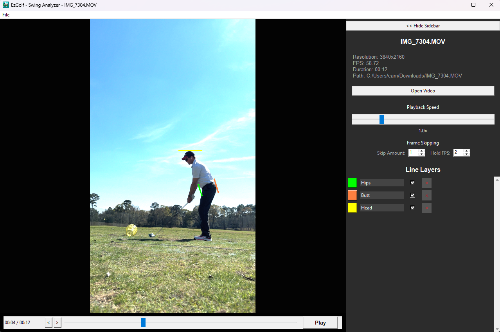
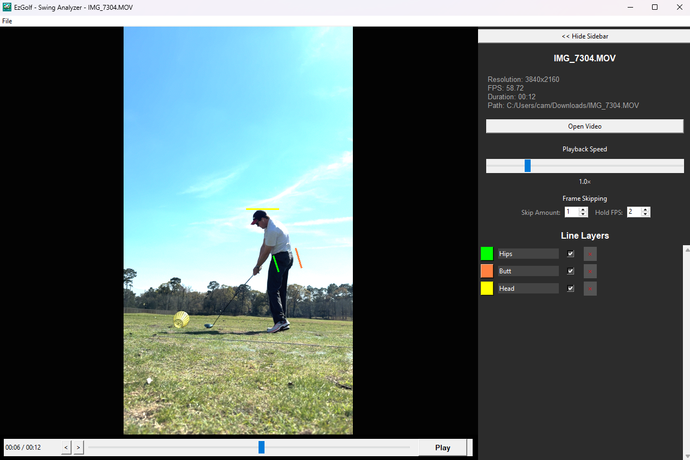
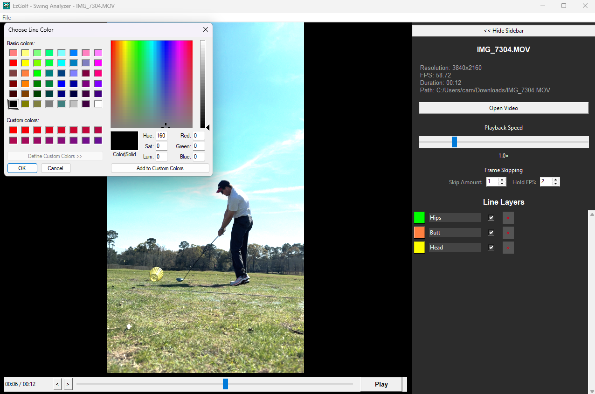
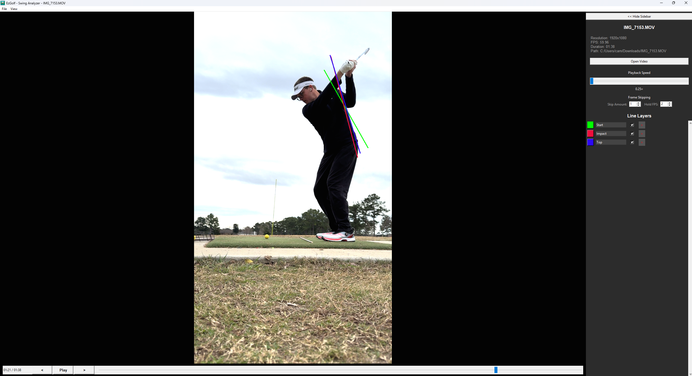
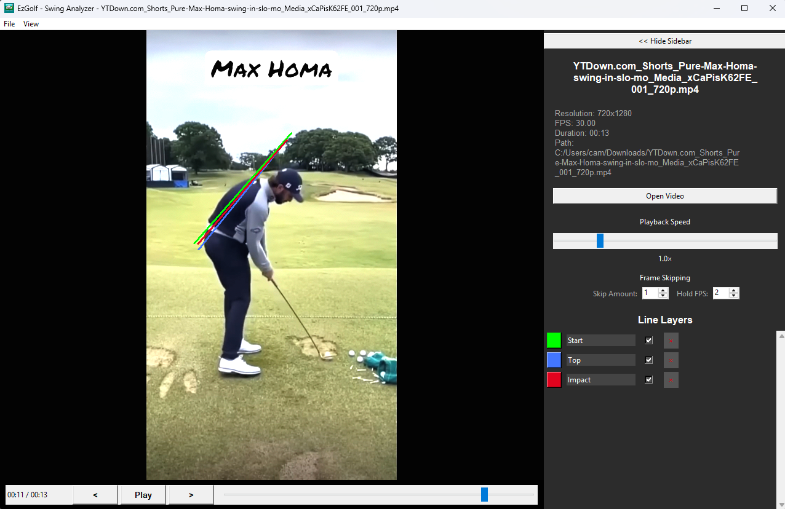

# EzGolf 🏌️‍♂️

Just download and run the .exe to get going on Windows. 

**EzGolf** is a Python-based golf swing analyzer designed to help golfers break down their mechanics. By leveraging high-performance video playback, it provides a smooth interface for reviewing swing frames and identifying areas for improvement.

## 🌟 Features
* **High-Fidelity Playback:** Uses the `libmpv` engine for frame-accurate seeking.
* **Swing Analysis:** Tools to review posture, club path, and impact positions.
* **Portable:** Can be compiled into a single `.exe` for use on any Windows machine without requiring a Python installation.

## 🛠 Tech Stack
* **Language:** Python 3.x
* **Video Engine:** [mpv](https://mpv.io/) (via `mpv-1.dll`)
* **Graphics Support:** Direct3D Compiler (`d3dcompiler_43.dll`)
* **UI/Assets:** Cool nostalgic icon maybe you know it too (`ezgolf.jpg`)

## 🚀 Getting Started

### Prerequisites
To run the source code, you will need:
* Python 3.10+
* The following DLLs in the root directory (included in the release bundle):
    * `mpv-1.dll`
    * `d3dcompiler_43.dll`

### Installation
1. Clone the repository:
   ```bash
   git clone [https://github.com/camwin/EzGolf.git](https://github.com/camwin/EzGolf.git)
   cd EzGolf
   python ezGolf.py

### 📸 Screenshots

<p align="center">
  

  

  

  

  

</p>
